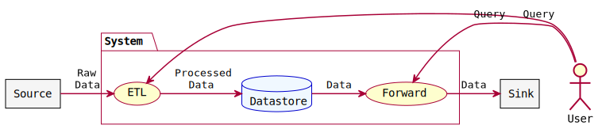
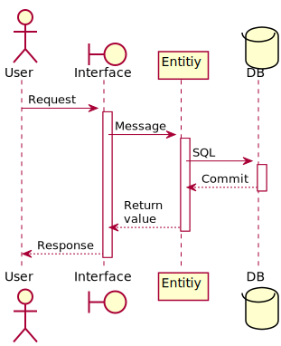

# 機能定義書 <!-- omit in toc -->

全体概要．

- [データフロー図](#データフロー図)
- [機能一覧](#機能一覧)
    - [機能1](#機能1)

## データフロー図

概要．

## 機能一覧

### 機能1

概要．

#### シーケンス図

#### 処理詳細

1. 手順1：
    - 補足．
2. 手順2：
    - 補足．
3. 手順3：
    - 補足．
